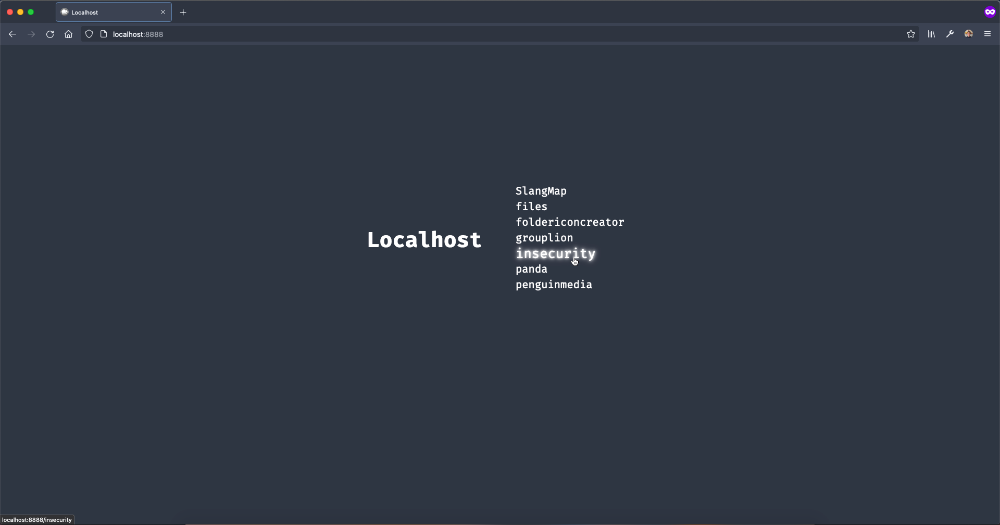
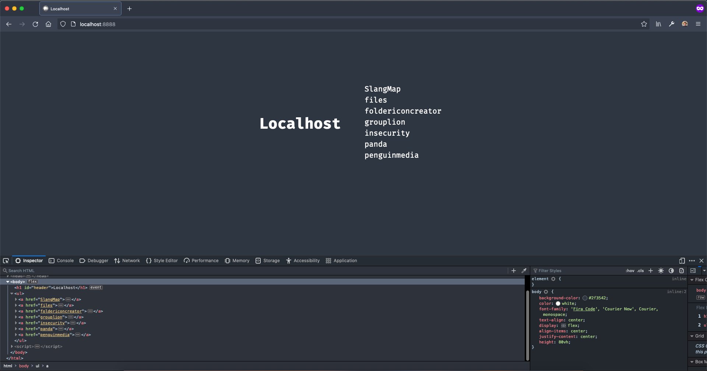
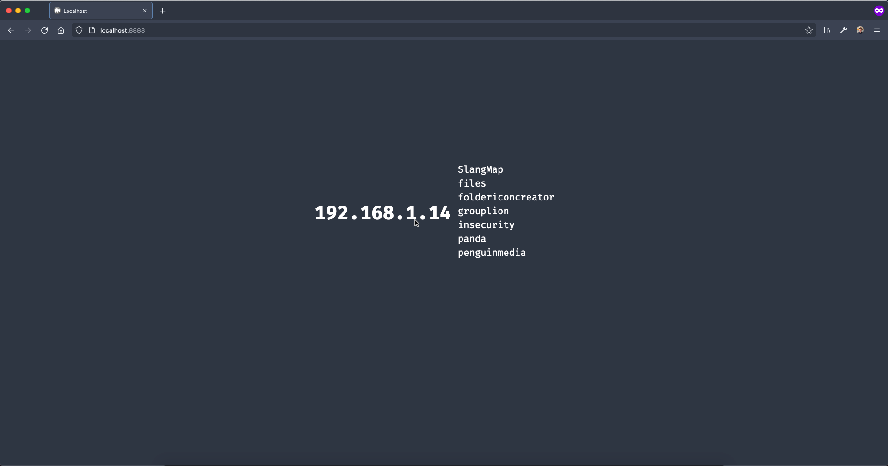

# localhost-dashboard

A dashboard for local servers.

This a barebones dashboard for PHP servers to spice up your "Index of" page. It automatically finds all the folders in your htdocs folder and functions just like Apache's "Index Of" page.

 

## Install

Simply add `index.php` and `favicon.ico` to your `htdocs` folder.

---

 

### Paired with [one-monokai-firefox-devtools](https://github.com/benfaerber/one-monokai-firefox-devtools) and [Nord-Polar Night Theme](https://github.com/ChristosBouronikos/Nord-Polar-Night-Theme)

---

 

### It displays your local IP Address while hovering over the header

---

 
